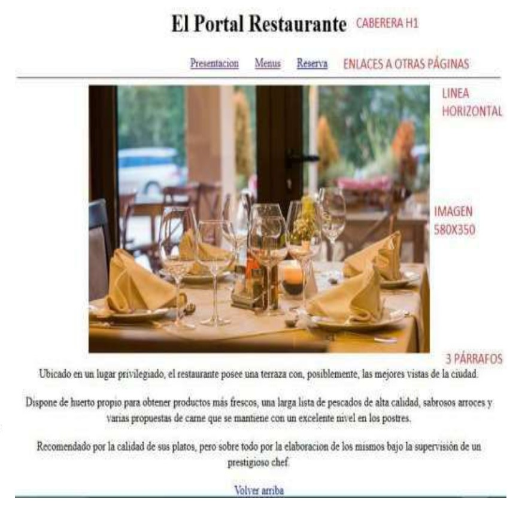
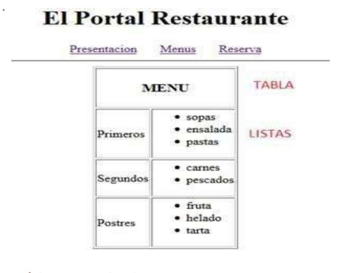
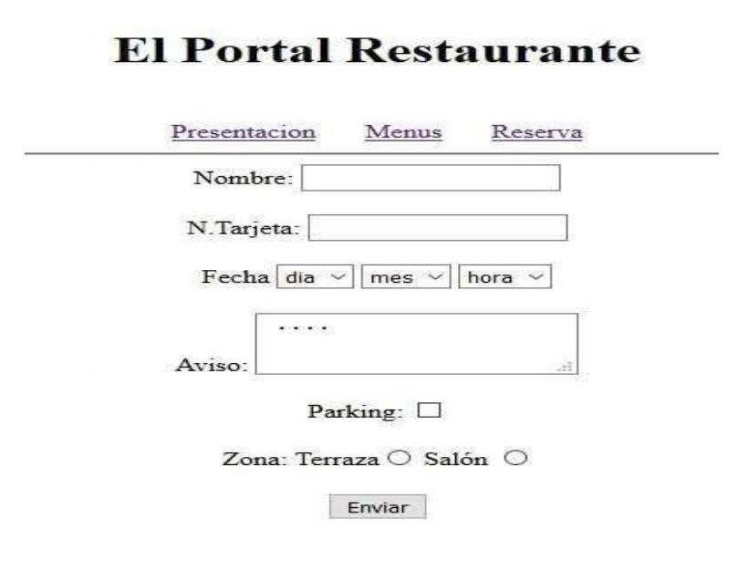

# Feedback 01

Crear un portal web formado por tres ficheros **html**:

- Index
- Menú
- Reserva

Se accederá a cada uno de los archivos a través del menú de la parte superior de todas las páginas (puedes utilizar otras imágenes).

## **Index**

## **Menú**

## **Reserva**

## Notas Importantes

1) Se valorará que la página sea totalmente **dinámica** (enlaces a otras páginas, etc...)
2) Se valorará la iniciativa del alumno en base a cada una de las páginas diseñadas (menú, reserva) como incluir imágenes, enlaces, botones donde tenga sentido hacerlo.
3) El formulario deberá de ser funcional de modo que cuando se pulse el botón Enviar se envíe los datos a algún sitio. También podría haber más botones además del botón Enviar que considere el alumno de manera lógica.
