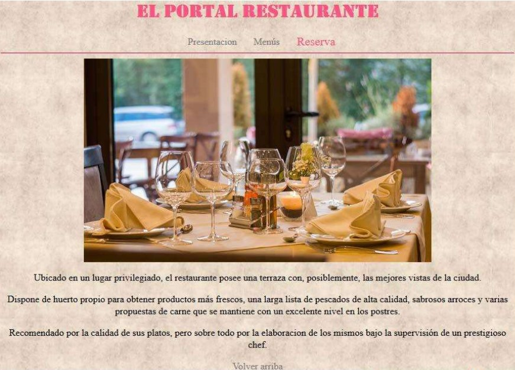
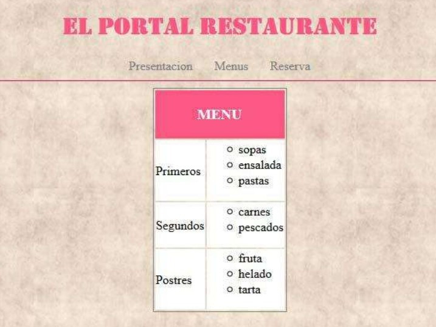
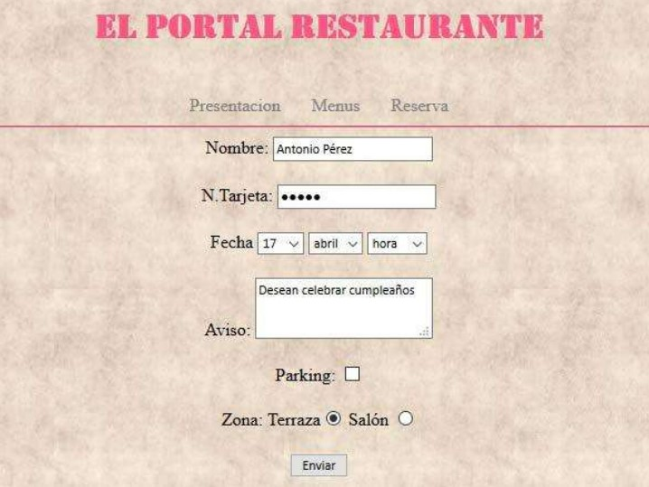

# Feedback 02

Aplicar hojas de estilos a las páginas anteriores a través de un fichero externo **.css**.

## En la página **index.html** se deben aplicar los siguientes cambios:

- Título con otro tipo de letra y color.
- Los enlaces no visitados y visitados son de color gris. Cuando nos ponemos encima del enlace la letra aumenta y cambia de color.

## En la página **menu.html** deben aparecer los siguientes estilos:

- Cambiar el borde de la tabla
- Los fondos de las celdas blancos, excepto el de la cabecera de la tabla que será de otro color y el texto blanco.
- Las viñetas de las líneas se modifican con los estilos.

## En la página de formulario, el texto de los campos a rellenar será de otra familia y de un tamaño más pequeño.

