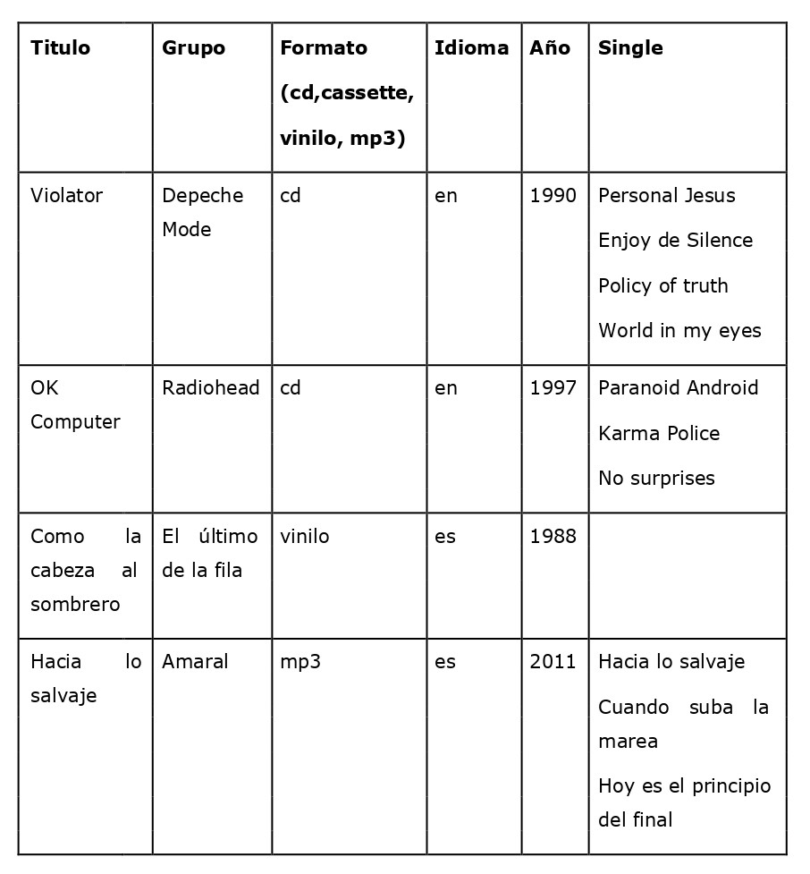

# Feedback 03
## 01. Crea un documento **xml** con los datos de la tabla teniendo en cuenta las siguientes condiciones:

- Formato e idioma serán atributos.

## 02. Realiza un fichero **.dtd** para validar el documento anterior teniendo en cuenta que:

- Formato sólo podrá tener los valores (cd, cassette, vinilo y mp3).
- El formato es obligatorio, el idioma opcional.
- El título y el grupo obligatorios.
- Año y Singles opcionales.
- Single será un elemento vacío.

## 03. Realiza un esquema **.xsd** para validar el ejercicio anterior.
