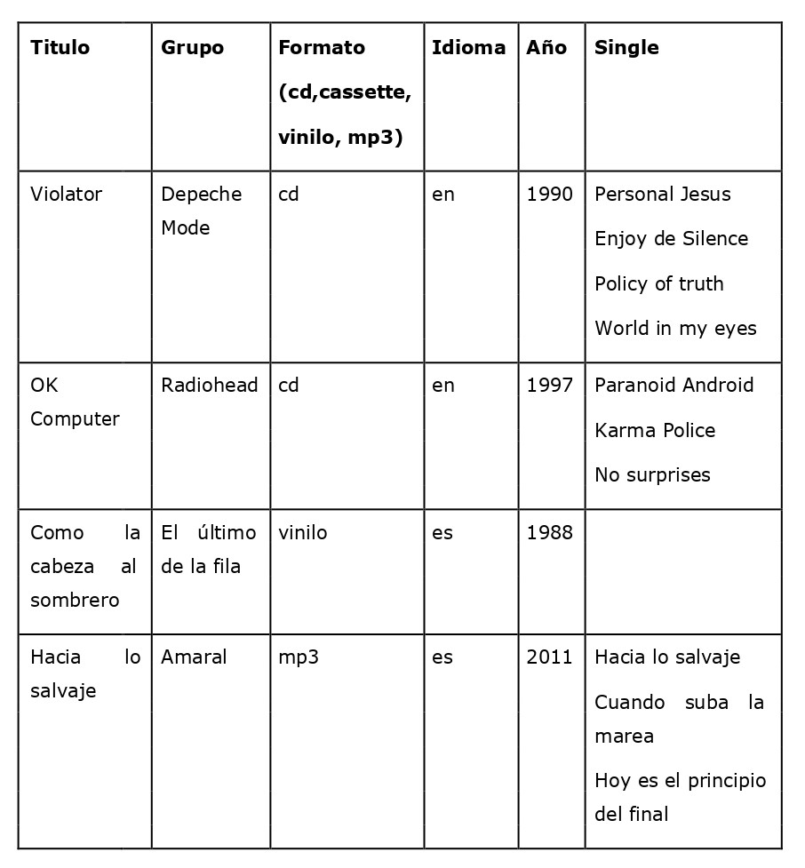

# Feedback 04
Basándote en el documento **.xml** que realizaste para la siguiente 
tabla:

## 01. Realiza las siguientes consultas con **PATH**: 
 
- Muestra todos los nodos de los discos que hay en el archivo.
- Muestra todos los títulos de todos los discos que están en inglés.  
- Muestra el nombre de los grupos que tienen discos en español.  
- Muestra el título de los discos que se publicaron después del año 2000.
- Muestra el título del disco que está en la posición 3.  
- Muestra el título del penúltimo disco.  
- Cuenta los discos que hay en el fichero. 
 
## 02. Realiza las siguientes consultas con **XQUERY**: 
 
- Muestra el título de todos los discos.  
- Muestra los nodos de los discos que se publicaron después del año 2000.  
- Muestra los títulos de los discos que están en español  -     
